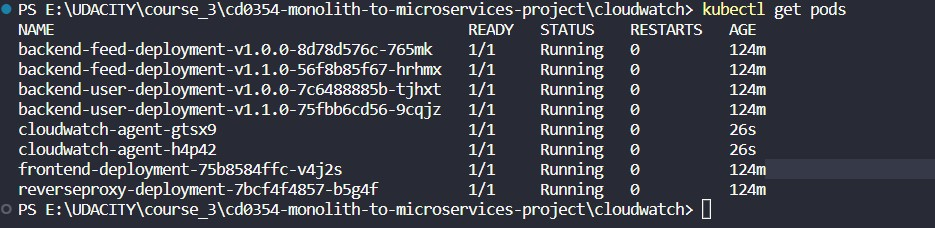
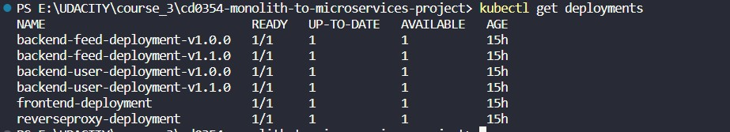
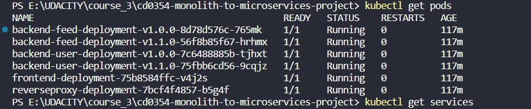
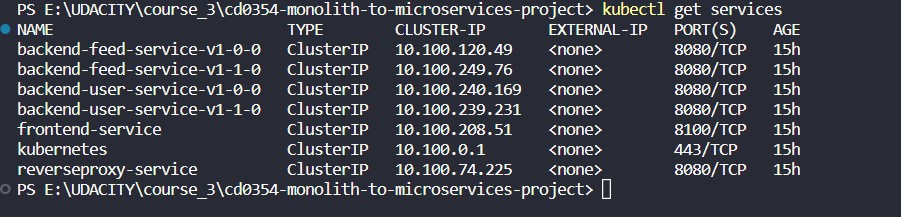

# Capstone Project Documentation:

I have enabled CloudWatch metrics and added Canary Deployment to fulfilled `Capstone Project`. 

- I modified `nginx.conf` file so that Nginx can also act as a load balancer.

    There are 2 versions: v1.0.0 and v1.1.0 in EKS, each version has assigned a weight, 5 for old version and 1 for new version.
    That means out of every 6 requests, 5 are sent to the old version and 1 to the new one. 
    `nginx.conf` file content:
    ```
        worker_processes 1;  
        events { worker_connections 1024; }
        error_log /dev/stdout debug;
        http {
            sendfile on;
            upstream user {
                server backend-user-service-v1-0-0:8080 weight=5;
                server backend-user-service-v1-1-0:8080;
            }
            upstream feed {
                server backend-feed-service-v1-0-0:8080 weight=5;
                server backend-feed-service-v1-1-0:8080;
            }
            proxy_set_header   Host $host;
            proxy_set_header   X-Real-IP $remote_addr;
            proxy_set_header   X-NginX-Proxy true;
            proxy_set_header   X-Forwarded-For $proxy_add_x_forwarded_for;
            proxy_set_header   X-Forwarded-Host $server_name;    
            server {
                listen 8080;
                location /api/v0/feed {
                    proxy_pass         http://feed;
                }
                location /api/v0/users {
                    proxy_pass         http://user;
                }            
            }
        }
    ```

- I also enabled Cloudwatch metrics.  


## Deployment steps: 
Step 1: Create EKS cluster with eksctl just like in project 3.
Step 2: Deploy frontend, reverseproxy and two version of backend-user and backend-feed into the cluster by running `deploy.sh` file.


## Enable Cloudwatch metrics step:
Step 1: Create a service account in the cluster
    
    kubectl apply -f cwagent-serviceaccount.yaml

Step 2: Create a ConfigMap for the CloudWatch agent
    
    kubectl apply -f cwagent-configmap.yaml

Step 3: Deploy the CloudWatch agent as a DaemonSet
    
    kubectl apply -f cwagent-daemonset.yaml

Validate that the agent is deployed by running the following command:
        
    kubectl get pods



## Testing
I have configure successfully and also added some capture into /documentation/image folder so you can use them to review more easily.
Deployments:


Pods:


Services:



